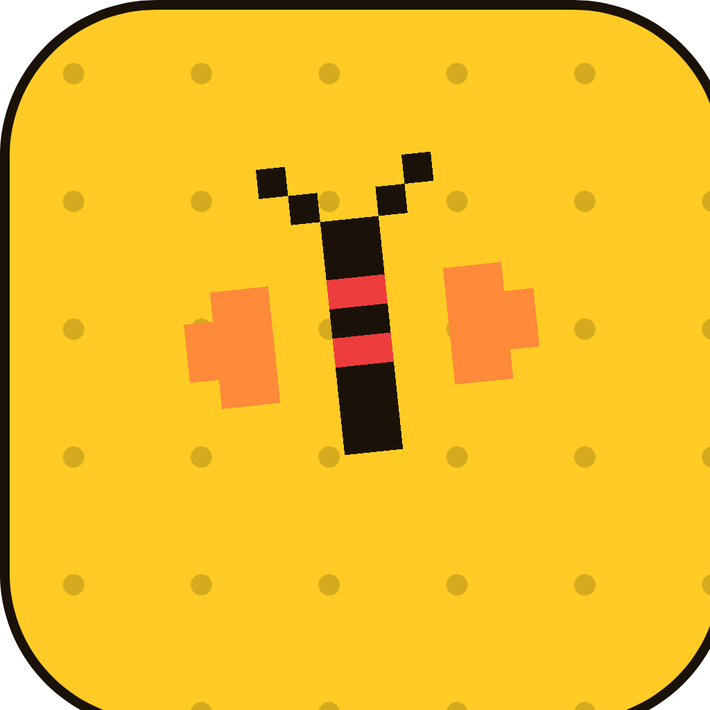

  

<h1 align="center">Critterboard</h1>

<strong>id any bug · stay offline · be smug</strong>

  The free insect hunting game that runs entirely on your phone. 
  No cloud. No account. No $$$.

  <code>Coming soon · iOS &amp; Android</code> · MIT Open Source

## What it does

|                  |                                         |
| ---------------- | --------------------------------------- |
| **Snap & ID**    | Local model. Zero uploads. Ever.        |
| **Hunt & Rank**  | Quests, XP, rarity tiers, global board. |
| **On-Device AI** | 3 guide personas. Snarky to calm.       |

✓ no account · ✓ no internet needed · ✓ no $$$ · ✓ no tracking by default · ✓ MIT licensed

### Optional social (opt-in)

Bug ID and AI always stay on-device. If you turn **Network** on in Settings, the app may sync **anonymous, pseudonymous** activity — catches, XP, friend links, leaderboard rank — to a [Cloudflare Workers](https://workers.cloudflare.com/) backend so social features work. No account, no email, no ads. Flip Network off and nothing leaves the phone.

## Current work

Project status lives in [`tasks/todo.md`](tasks/todo.md) — the living checklist of what's shipped and what's next.

**Local AI training** — The app UI and seams are done; real models aren't wired yet. Training pipelines are scaffolded and runnable:

- **Vision** — 20-species classifier on an M2 (`training/local/`), full EU run on Kaggle (`training/kaggle/`). Next step: export to `assets/models/` and flip `USE_NATIVE_VISION` in `src/ai/`.
- **Personas** — LoRA pipeline for on-device Llama 3.2 1B (`training/personas/`). Next step: bundle a GGUF and flip `USE_LLAMA_RN` in `src/ai/`.

See [`docs/ml-roadmap.md`](docs/ml-roadmap.md) for the three-track plan and exit criteria.

**Cloudflare connectivity** — The client-side backend adapter is shipped (leaderboard, friends, activity feed). Social hooks gate on `profile.networkOn`; the mock resolves locally today. The Cloudflare Workers service is not deployed yet — `src/backend/cloudflare.ts` is a stub. Flip `USE_REMOTE_BACKEND` in `src/backend/index.ts` once the Worker is live. See [`docs/decisions/002-backend-adapter-seam.md`](docs/decisions/002-backend-adapter-seam.md).

## Links

- Landing page : [`critterboard.app`](https://critterboard.app)
- Contact: [hello@critterboard.app](mailto:hello@critterboard.app)
