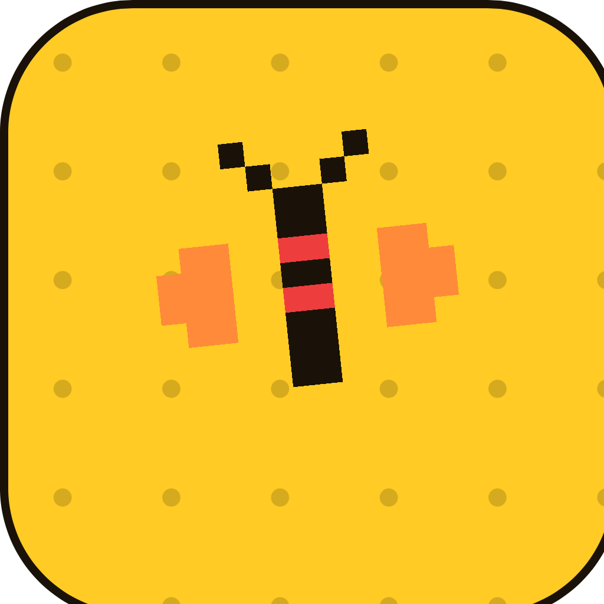
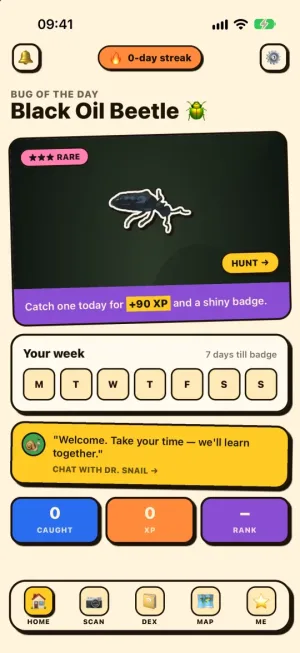
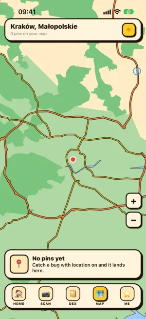
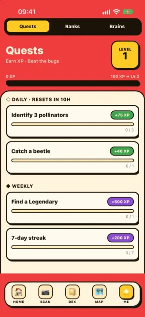
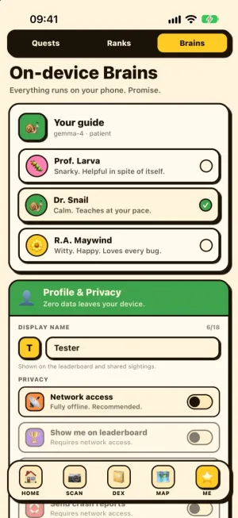

<p align="center">
  
</p>

<h1 align="center">Critterboard</h1>

<p align="center"><strong>id any bug · stay offline · be smug</strong></p>

<p align="center">
  The free insect hunting game that runs entirely on your phone.<br />
  No cloud. No account. No $$$.
</p>

<p align="center">
  <code>Coming soon · iOS &amp; Android</code> · MIT Open Source · <a href="https://critterboard.app">critterboard.app</a>
</p>

<p align="center">
  
  
  
  
</p>

## What it does

Point the camera at an insect (or pick a photo) and the phone names it. Nothing is uploaded: the species model runs on the device.

- **Scan & ID:** 1,000 Central European insects and spiders, recognised on-device. Unsure results show the top candidates; anything under your confidence floor (default 33%) can't enter the Dex.
- **Dex:** every species as a sticker icon drawn from a real photo, with habitat, size, range and diet. Uncaught species show as silhouettes.
- **Hunt & level up:** XP per species by rarity, daily and weekly quests, badges, levels and day streaks (with freezes that cover a missed day).
- **Offline map:** a map of Europe that works with no signal, with your catches as pins, and (if you turn it on) other players' nearby sightings.
- **Guides:** three personas (snarky Prof. Larva, calm Dr. Snail, cheerful R.A. Maywind) to chat with about what you found, run entirely on the phone by Google's Gemma 4 E2B.
- **4 languages:** English, Polski, Deutsch, Español.
- **Your data stays yours:** backup and restore to a file, clear scan photos, wipe everything.

✓ no account · ✓ works offline · ✓ no $$$ · ✓ nothing leaves the phone by default · ✓ MIT licensed code (models, map data and icons: see [`NOTICE.md`](NOTICE.md))

### What gets downloaded

The app itself is small. Species and the map come as a **region pack**, downloaded once from the Brains tab (ideally on Wi-Fi):

| Download | Size | Needed for |
| --- | --- | --- |
| Central Europe pack: species model | 88 MB | Scan |
| Central Europe pack: offline map of Europe | 56 MB | Map |
| Gemma 4 E2B chat model (optional) | 3.1 GB | Chatting with the guides (phones with 4 GB of RAM ask first; smaller phones can't chat) |

### Optional social (opt-in)

Bug ID and chat always stay on-device. If you turn **Network** on in Brains, the app syncs **pseudonymous** activity (catches, XP, friends, leaderboard rank) to a [Cloudflare Workers](https://workers.cloudflare.com/) backend so rankings and friends work. No account, no email, no ads. Shared catches appear with their exact spot, species and date (never your name) on nearby players' maps, and turning sharing off deletes the locations from the server. Everything uploaded can be deleted again from the app, and with Network off nothing leaves the phone. Crash reports are a separate opt-in.

## Where things stand

Status lives in [`tasks/todo.md`](tasks/todo.md), the living checklist of what's shipped and what's next.

- **Vision:** `eu-1k-commercial-v1`, 1,000 European insects and spiders, 78.2% top-1 and 90.1% top-3 on held-out photos. Runs through `react-native-executorch`. Licence-clean for commercial use: trained only on CC0/CC-BY photos on Google's Apache-2.0 base. See [`training/vision/README.md`](training/vision/README.md) and the [model card](training/vision/results/commercial-1k-v1/MODEL_CARD.md).
- **Chat:** Gemma 4 E2B (Apache 2.0) through `llama.rn`. No scripted fallback and no web chat ([ADR 005](docs/decisions/005-gemma-4-only-chat.md)). Personas are system prompts; a LoRA pipeline for per-persona adapters is in [`training/personas/`](training/personas/), not shipped.
- **Map:** MapLibre Native drawing a local PMTiles file in the app's sticker style ([`docs/modules/offline-map.md`](docs/modules/offline-map.md)).
- **Backend:** live on Cloudflare Workers (D1, KV, a Durable Object), deployed 2 Oct 2026 ([`docs/modules/backend-adapter.md`](docs/modules/backend-adapter.md)).
- **Next:** more testing on real phones, translated names for the pack species (pl/de/es fall back to English today), choosing where the models are hosted, and store submission.

## Tech stack

| Area | What |
| --- | --- |
| App | Expo SDK 57, React Native 0.86 (New Architecture), TypeScript, Zustand |
| On-device ML | `react-native-executorch` (vision `.pte`), `llama.rn` (Gemma 4 E2B GGUF) |
| Map | `@maplibre/maplibre-react-native` + PMTiles (Protomaps basemap) |
| Backend | Cloudflare Workers + D1 + KV + Durable Objects ([`worker/`](worker/)) |
| Training | PyTorch, `timm`, ExecuTorch export ([`training/vision/`](training/vision/)) |
| Website | Static page on Cloudflare ([`website/`](website/)) |

## Run it

Needs Node 22, pnpm 10 and Xcode (or Android Studio). The app uses native modules, so Expo Go won't work: build a dev client.

```bash
pnpm install
```

```bash
pnpm ios:sim
```

```bash
pnpm run check
```

`ios:sim` builds and opens the app in the iOS Simulator, and `check` runs the type check and the unit tests. For a physical iPhone, EAS builds, Android and the backend, follow [`docs/handoff.md`](docs/handoff.md).

## Repository layout

| Path | What's there |
| --- | --- |
| [`src/`](src/) | The app: screens, store, on-device AI, map, i18n, backend client |
| [`packs/`](packs/) | Region packs: species list, model, map, icon atlas (downloaded by the app) |
| [`worker/`](worker/) | Cloudflare Worker API (`npm run smoke` tests it end to end locally) |
| [`training/`](training/) | Vision model pipeline (`vision/`), persona LoRA (`personas/`), the original 20-species pipeline (`local/`) |
| [`tools/`](tools/) | Map pack extraction, species facts and names, pack builders |
| [`website/`](website/) | Landing, support, privacy and terms pages |
| [`docs/`](docs/) | Architecture notes and decisions ([index](docs/README.md)) |

## Docs

- [`docs/README.md`](docs/README.md): map of all architecture docs and ADRs
- [`docs/architecture.md`](docs/architecture.md): system overview
- [`docs/ml-roadmap.md`](docs/ml-roadmap.md): the on-device ML plan
- [`docs/modules/ui-performance.md`](docs/modules/ui-performance.md): what keeps the UI fast

## Links

- Landing page: [critterboard.app](https://critterboard.app)
- Contact: [hello@critterboard.app](mailto:hello@critterboard.app)
- Licence: [MIT](LICENSE) for the code; models, map data, photos and icons in [`NOTICE.md`](NOTICE.md)
