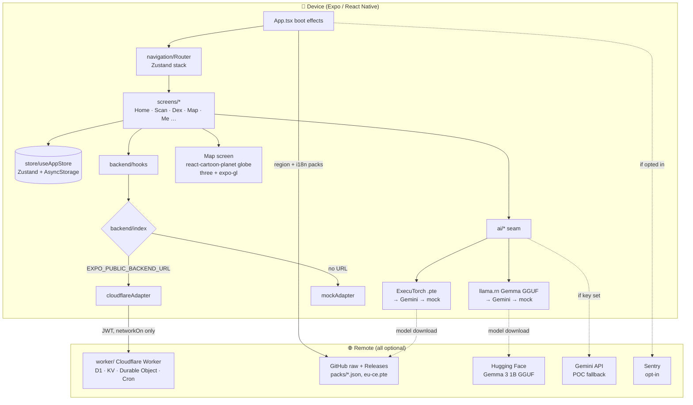

# Architecture overview

`#architecture` `#index`

Critterboard is an Expo (SDK 57) React Native app, TypeScript throughout. It runs on iOS, Android and web from one codebase. It is local-first: bug ID, chat and all game state live on the device. The only optional server is a Cloudflare Worker for social features, and it is gated behind the Network toggle in Settings.

> See also: [[deployment]] (EAS builds), [[modules/backend-adapter]] (Cloudflare seam), [[ml-roadmap]] (on-device models), [[i18n]] (language packs).

## Top-level map

## Folders

| Path | Role |
|---|---|
| `App.tsx` / `index.ts` | Boot: language seeding, region-pack hydrate + refresh, i18n pack sync, crash reporting, streak notification. |
| `src/navigation/` | Type-safe route table + a Zustand-backed stack router (no react-navigation). |
| `src/screens/` | One file per screen. `Map.tsx` / `Map.web.tsx` differ only in which globe component they import. |
| `src/components/` | Shared UI ("sticker" design language, tokens in `src/tokens/pb.ts`). |
| `src/store/` | Single persisted Zustand store: profile, catches, dex, quests, installed packs, backend id. |
| `src/ai/` | Vision + chat seams with guardrails. Flags in `src/ai/index.ts`. |
| `src/backend/` | Backend adapter seam, see [[modules/backend-adapter]]. |
| `src/data/` | Static seeds (bugs, sightings, quests, badges, regions) + region-pack loader. |
| `src/i18n/`, `assets/i18n/` | Bundled en/pl/de/es packs + remote pack sync. |
| `worker/` | Cloudflare Worker (`critterboard-api`), D1 schema, wrangler config. Deployed on its own, not bundled into the app. |
| `packs/` | Region-pack manifest + pack JSON, served from `raw.githubusercontent.com`. |
| `training/`, `tools/training-ui/` | Python pipelines for the vision model and persona LoRAs. |
| `website/` | Static landing page (currently configured for Netlify). |
| `evals/` | Evalite chat evals. |

## Native surface (what forces a dev client)

These modules have native code, so the app **cannot run in Expo Go** and needs an EAS development build:

- `react-native-executorch` (vision; its podspec pins iOS **17.0**)
- `llama.rn` (on-device LLM; postinstall downloads `rnllama.xcframework`)
- `expo-gl` + `three` (Map globe on native)
- `@sentry/react-native`, `expo-camera`, `expo-location`, `expo-notifications`, `expo-image-picker`, Reanimated/Worklets

## Network touchpoints

Everything below is optional. Without it the app degrades to bundled or mock behavior.

| Call | When | Source |
|---|---|---|
| Region pack + `.pte` model | User installs a pack; refreshed on boot | `packs/manifest.json` → GitHub raw / Releases |
| Translation packs | Boot, best-effort | `src/i18n/loader.ts` |
| Gemma GGUF | First on-device chat | Hugging Face |
| Gemini | Only if an API key is inlined at build time | `src/ai/geminiVision.ts`, `toolChatAdapter.ts` |
| Cloudflare Worker | `profile.networkOn` **and** `EXPO_PUBLIC_BACKEND_URL` set | `src/backend/cloudflare.ts` |
| Sentry | `profile.crashReportingOn` **and** DSN set | `src/lib/crashReporting.ts` |
