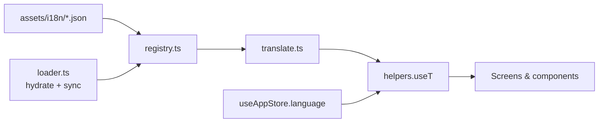

#i18n architecture

#architecture #data-model

Critterboard ships with four bundled languages: **English, Polish, German, Spanish**. Strings live in JSON packs under `assets/i18n/` and are resolved by a tiny custom `t()` helper. No `i18next`, no `expo-localization`, no native dependency.

## Why custom

Three reasons:

1. **Tracks the offline ethos.** The whole app pitches "everything on device". Adding a 30 KB i18n runtime + locale-aware Intl polyfill cuts against that. The custom layer is ~150 lines.
2. **OTA-friendly.** Packs are pure JSON. The same file the app bundles can be fetched from a remote manifest URL, cached in AsyncStorage, and live-swap into the registry — no app release required for a copy fix. See [[#Remote pack delivery]].
3. **Type safety where it matters.** The English pack ([`assets/i18n/en.json`](../assets/i18n/en.json)) is the source of truth. Missing keys in other packs fall back to English at lookup time, so a partial translation never breaks the UI.

## File layout

```
assets/i18n/
  en.json          # source of truth — every key lives here first
  pl.json          # mirrors en.json, translated
  de.json
  es.json

src/i18n/
  types.ts         # LangId, Pack, Dict, RemotePackManifest, LANG_META
  registry.ts      # in-memory pack registry + subscribe API
  translate.ts     # resolve() + interpolate() + translateFor()
  loader.ts        # AsyncStorage cache + remote manifest fetch
  helpers.ts       # useT(), useBugName(), countryName()
  index.ts         # public surface
```



## The lookup contract

```ts
import { useT } from '@/i18n/helpers';

const t = useT();
t('home.streakPill', { days: 4 }); // → "4-day streak" / "passa 4 dni" / …
```

- Keys are dotted paths: `home.streakPill`, `regions.detail.na-ne.tagline`.
- Numeric segments walk array elements: `regions.detail.na-ne.notes.0`.
- `{var}` placeholders are replaced from the second argument.
- Missing keys fall back to English; missing in English too return the literal key (visible in dev, `console.warn`'d).

Non-React callers (data files, mock LLM, store actions) use the imperative form:

```ts
import { t } from '@/i18n';
t(language, 'settings.guideToast', { name });
```

## Data files

Static data with display strings keeps its IDs and machine-readable bits, but the human-readable bits move to the packs. See [[modules/data-strings]] for the convention.

| File | Stays here | Lives in pack |
|---|---|---|
| `bugs.ts` | id, latin, rarity, xp, tier, emoji, color | `bugs.<id>.name` |
| `regions.ts` | id, emoji, size, color, families[].count, samples[].id | `regions.list.<id>.*`, `regions.detail.<id>.*` |
| `badges.ts` | id, icon, color, unlocked | `badges.items.<id>.{name,desc,crit,earned}` |
| `quests.ts` | id, progress, total, reward, kind | `quests.labels.<id>`, `quests.details.<id>.*` |
| `personProfiles.ts` | id, emoji, color, country (ISO), city, joined, level, rank, xp, badge, recent | `person.bio.<id>`, `person.friend.<lastKey>`, `person.why.<whyKey>` |
| `personas/index.ts` | id, emoji, avatarBg, cardBg, systemPrompt | `personas.<id>.{name,title,blurb,lines.*,canned.*}` |

Latin species names, ISO country codes, dates, and usernames stay in source — they're either format-stable or conventionally English.

## Adding a new key

1. Add it to `assets/i18n/en.json` (source of truth).
2. Mirror into `pl.json`, `de.json`, `es.json` with translations. Missing entries fall back to English, so it's safe to ship a partial translation and fill in later.
3. Use it via `t('your.new.key')`.

## Adding a new language

1. Drop a new file `assets/i18n/<lang>.json` with the same key shape.
2. Add the lang to the `LangId` union and `LANG_META` array in [`src/i18n/types.ts`](../src/i18n/types.ts).
3. Register it in `src/i18n/registry.ts` (one import + one map entry).
4. The Settings → Language picker auto-renders any lang present in `LANG_META`.

## Remote pack delivery

The OTA layer is **disabled by default**. To enable, set a manifest URL once on app boot:

```ts
import { setPackManifestUrl } from '@/i18n';
setPackManifestUrl('https://example.com/critterboard/i18n/manifest.json');
```

The manifest schema:

```json
{
  "manifest": 1,
  "packs": {
    "pl": {
      "version": 2,
      "url": "https://example.com/critterboard/i18n/pl-v2.json",
      "sha256": "optional-hex"
    },
    "de": { "version": 3, "url": "https://example.com/critterboard/i18n/de-v3.json" }
  }
}
```

On launch, `App.tsx` runs:

1. `hydrateCachedPacks(['en','pl','de','es'])` — replay any previously cached remote packs from `AsyncStorage` into the in-memory registry, so the user sees the last-known-good remote version offline.
2. `syncRemotePacks()` — fetch the manifest, download any pack whose `version` exceeds the cached one, register + cache it.

Both calls swallow errors silently. Bundled packs are always the floor; remote packs are pure enrichment.

### App Store policy

Apple [Guideline 4.7](https://developer.apple.com/app-store/review/guidelines/#software-requirements) restricts downloading executable code. JSON strings are content — same category as remote config, CMS-driven copy, or a news feed. Hundreds of apps do this (Duolingo, Slack, Twitter, every news app). No issue.

## Reactivity

`useT()` re-renders when:

- `useAppStore((s) => s.language)` changes — user flipped the Settings picker.
- A remote pack download lands and `registerPack()` fires — `subscribePacks` listeners notify, the hook's `useSyncExternalStore` re-pulls.

The hook returns a stable function for a given `(language, packVersion)` tuple, so it's safe to use in `useMemo`/`useCallback` dependency lists.

## Related

- [[architecture]] — top-level system overview
- [[decisions/001-on-device-everything]] — why no cloud, why JSON over runtime fetch
