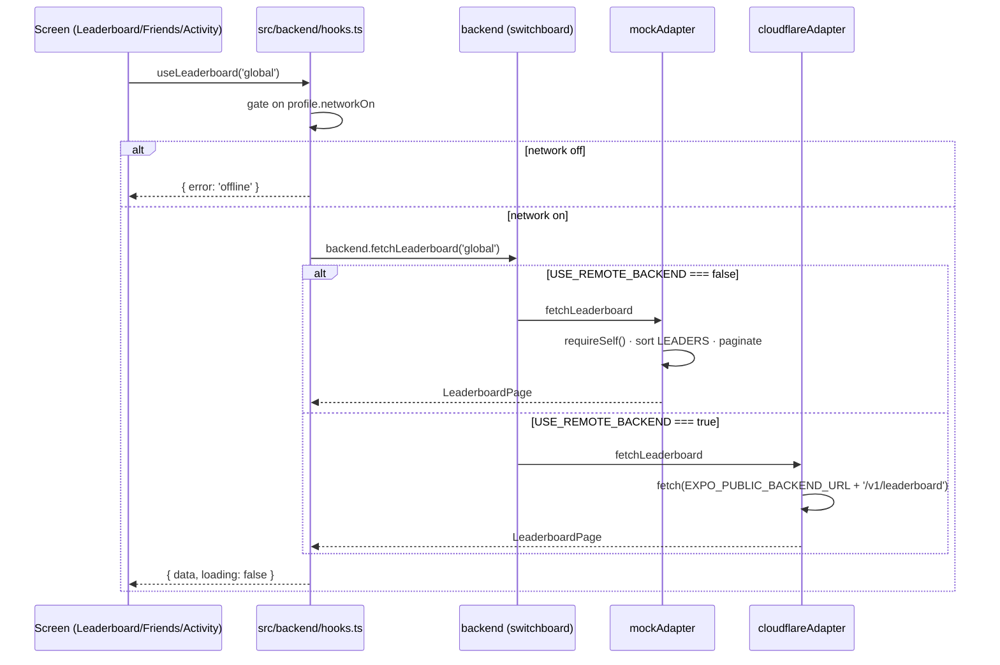

# Backend adapter

`#architecture` `#data-model` `#api` `#privacy`

Single seam between the UI and any out-of-process service. Today it resolves to an in-process mock (synthesizes from the existing static seeds); the same code paths will route to a Cloudflare Workers service once that ships.

> See also: [[../decisions/002-backend-adapter-seam]] (the *why*), [[crash-reporting]] (sibling — same opt-in posture for any-byte-leaves-device features), [[../architecture]] *(planned)*.

## Why a seam

The leaderboard, friend graph and social feed *can't* be derived from the device alone — they need other users' data. But everything else in Critterboard is local-first and the Settings copy promises so. Burying network calls inside screen components would scatter that surface across the codebase and make the offline path bespoke per screen.

One adapter, one chokepoint:

- The hooks layer is the only place that touches `backend.*`. Screens never import the adapter directly.
- Every call is gated on `profile.networkOn`. With the master switch off, no adapter method is ever called.
- The mock and the real impl share an identical TypeScript surface. Swap is one line.

## Pieces

| File | Role |
|---|---|
| `src/backend/types.ts` | Wire schemas — `BackendUser`, `LeaderboardEntry`, `FriendNode`, `FeedEvent`, page envelopes, `BackendError`. |
| `src/backend/adapter.ts` | `BackendAdapter` interface — `identity / syncProfile / publishCatch / fetchLeaderboard / fetchFriends / fetchFeed / follow / unfollow / ready`. |
| `src/backend/mock.ts` | Default impl. Projects `LEADERS` and `FRIENDS` onto the wire types, generates a deterministic peer-activity ticker for the social feed. Identity is injected via `bindMockIdentity`. |
| `src/backend/cloudflare.ts` | Placeholder. Throws `BackendError('unavailable')` on every method. See ADR 002 for the planned wiring. |
| `src/backend/index.ts` | Switchboard. `USE_REMOTE_BACKEND` flag picks mock or cloudflare. Re-exports types so consumers can import from `@/backend`. |
| `src/backend/hooks.ts` | React layer — `useLeaderboard / useFriends / useFeed / useToggleFollow / usePublishCatch / useBackendIdentityBridge`. Owns request state, network gating, and live identity binding. |
| `src/store/useAppStore.ts` | New `backendUserId` slice — device-local UUID, persisted, rotated on `wipeAll`. The mock treats it as the caller's id; the real adapter will exchange it for a Bearer token. |

## Flow



## Schemas at a glance

The interesting fields, with their invariants:

### `BackendUser`

| Field | Notes |
|---|---|
| `id` | Opaque, server-owned (UUID v4 today, mock uses display name as id). UI never parses it. |
| `displayName` | Mutable. Never assumed unique. |
| `country` | Two-letter ISO code, or `'private'` when location share is off. |
| `joinedAt` | Server-stamped epoch ms. |

### `LeaderboardEntry`

`rank` is 1-indexed within the page's scope. `rankDelta` is the change since the previous period (negative = climbed). `isSelf` flips for the caller's own row so the UI can highlight it without a name comparison.

### `FriendNode`

`rel` is one of `following / follower / mutual / suggested / none`. Suggested rows carry a `reason` discriminated union (`sharedBugs`, `nearby`, `viaFriend`) so the UI can render an explanation without re-querying.

### `FeedEvent`

Discriminated by `kind` — `catch / streak / badge / rankUp / follow`. Every event embeds an `ActorRef` (id + display name + avatar + current relation) so the UI can render without a joining round-trip.

### `BackendError`

One class, four kinds: `offline / unavailable / rate-limited / unknown`. Hooks turn these into UI states. Adapters never throw raw `Error`.

## Pagination

Cursor-based, opaque. The mock uses `String(offset)`; the cloudflare adapter is free to use D1 ROWID cursors, KV scan tokens, or Durable Object stream offsets — the UI doesn't care.

```ts
const { data } = useLeaderboard('global', { cursor: page?.nextCursor ?? undefined, limit: 20 });
```

## Identity binding

The mock can't reach back into Zustand (would create a circular import). Instead:

```ts
// at app boot
useBackendIdentityBridge();          // App.tsx
// every fetch hook also self-binds, so xp/followed are always fresh
```

Internally this calls `bindMockIdentity(() => self)`. The function pointer is swapped on every dep change — cheap, lock-free, and lets the mock pull fresh xp on every adapter call without subscribing to the store directly.

The real cloudflare adapter will use the same id (`useAppStore.getState().backendUserId`) but exchange it for a signed JWT on first call so subsequent requests don't have to re-send the raw id.

## Privacy posture

| Switch | Effect |
|---|---|
| `profile.networkOn` | Master gate. Off → hooks never call the adapter. Real adapter never opens a socket. |
| `profile.leaderboardOn` | Mock's `requireSelf().leaderboardVisible = false`. Server hides the user from public boards + feeds. |
| `profile.locationShareOn` | Without it `country` is `'private'` and `publishCatch` omits lat/lng. |
| `wipeAll` | Rotates `backendUserId` so the next session is indistinguishable from a fresh install. |

The local store is always the source of truth for follow state. Backend writes are fire-and-forget; a divergence between client and server self-heals on the next `fetchFriends` round-trip.

## Setup checklist (for the real Cloudflare service)

1. Deploy the Worker. Routes documented in ADR 002.
2. Set `EXPO_PUBLIC_BACKEND_URL` in `.env`.
3. Flip `USE_REMOTE_BACKEND = true` in `src/backend/index.ts`.
4. Run the app on a dev client with `profile.networkOn = true`. Watch the network tab — every screen should issue exactly the calls listed in this doc, no more.
