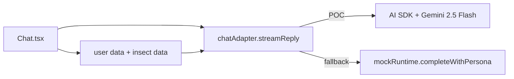

# Chat adapter (Gemini POC)

`#architecture` `#ai` `#chat` `#poc`

Chat now routes through a dedicated adapter seam in `src/ai/chatAdapter.ts` and uses the AI SDK (`ai` + `@ai-sdk/google`) with Gemini as a temporary cloud-backed proof-of-concept.

This is deliberately an interim step before the on-device Llama runtime in [[../ml-roadmap]].

## Why this exists

- Proves the end-to-end chat UX against a real model now (streaming, error handling, persona tone).
- Keeps model wiring isolated from `Chat.tsx`, so swapping to local `llama.rn` later is a one-file adapter change.
- Lets us test prompt-shaping with live app state (user profile + progression + insect catalog) before local inference lands.

## Current architecture

| File | Role |
|---|---|
| `src/ai/chatAdapter.ts` | `ChatAdapter` interface + `mockChatAdapter` + `geminiChatAdapter` implementation. |
| `src/ai/index.ts` | Switchboard chooses `chatAdapter` (Gemini when `GEMINI_API_KEY` is present, else mock). |
| `src/screens/Chat.tsx` | UI only. Streams chunks from `chatAdapter.streamReply(...)`, persists per-thread history, indexes messages into memory, and exposes clear-thread control. |
| `src/store/useAppStore.ts` | Persists `chatThreads` (`persona::topic` key) plus a searchable `conversationMemory` index with per-message keywords. |
| `src/lib/conversationMemory.ts` | Lightweight local keyword extraction + scored retrieval used to fetch cross-thread memory snippets for each prompt. |



## Prompt context sent to Gemini

Each request includes:

- Persona system prompt (`personas.<id>.systemPrompt`)
- User context snapshot:
  - language
  - profile/network/location flags
  - caught species count, XP, streak
  - followed users
  - recent catches
- Full in-app insect dataset (`BUGS`) with id/name/latin/rarity/xp/traits

This keeps answers grounded in Critterboard state instead of generic bug advice.

## History behavior

- Chat transcripts are persisted by default in Zustand storage.
- Thread key format is `persona::topic` (topic defaults to `general`).
- Opening Chat restores prior transcript for that thread.
- Header trash button clears only the current thread and resets to intro messages.
- Every user/assistant message is also indexed into `conversationMemory` with extracted keywords.
- Before each reply, the app retrieves relevant snippets (cross-thread) and sends them as memory context.
- Brains (`Settings`) includes a dedicated "Wipe stored conversations" control that clears both transcripts and memory index.

## Environment

Required for cloud POC:

```env
GEMINI_API_KEY=...
# Expo client fallback:
EXPO_PUBLIC_GEMINI_API_KEY=...
```

If the key is missing, the switchboard falls back to the mock chat adapter so the app stays usable.

## Privacy note

This cloud mode is a **proof-of-concept only**:

- Chat prompts are sent to Gemini while this adapter is active.
- In Expo client-only mode, the fallback `EXPO_PUBLIC_GEMINI_API_KEY` is embedded in the app bundle. This is acceptable only for short-lived POC testing.
- The long-term target remains on-device LLM inference per [[../ml-roadmap]].
- Once local runtime is production-ready, this adapter can be disabled in `src/ai/index.ts`.
