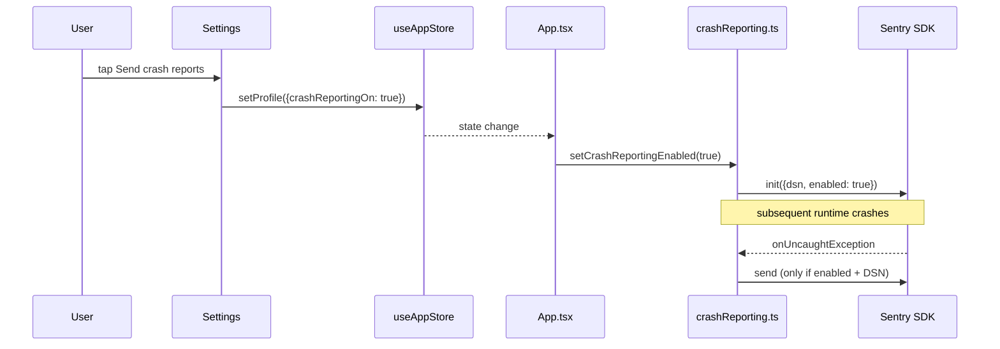

# Crash reporting

`#architecture` `#privacy` `#observability`

Opt-in crash reporting via [Sentry](https://docs.sentry.io/platforms/react-native/). Off on first launch, never sends a byte until the user explicitly enables it on the Settings screen.

> See also: [[../decisions/001-crash-reporting-opt-in]] (the *why*), [[../architecture]] (top-level system map).

## Why it's behind a toggle

Critterboard's Settings header reads **"Everything runs on your phone. Promise."** That promise is load-bearing — the leaderboard, location share, and now crash reports are the only data paths that ever leave the device, and all three live in the same Privacy section so the user can see the full set in one glance.

Crash reporting is gated by the same `networkOn` master switch as the other two. Flipping network off auto-clears `crashReportingOn`; there's no way to be online for crash reports while otherwise offline.

## Pieces

| File | Role |
|---|---|
| `src/lib/crashReporting.ts` | Wrapper around `@sentry/react-native`. Single chokepoint for init / setEnabled / capture. |
| `src/store/useAppStore.ts` | `profile.crashReportingOn` persisted in the same `Profile` blob as the other privacy flags. |
| `App.tsx` | Calls `initCrashReporting` at mount, re-syncs the SDK on every toggle flip. |
| `src/screens/Settings.tsx` | 🛟 toggle in the Profile & Privacy band. Disabled until network is on. |
| `assets/i18n/*.json` | `settings.crashLabel / crashOn / crashOff / crashNeeds` in all four packs. |

## Flow



## Graceful degradation

Three layers of safety. Any one of them being false means crash reports stay local:

1. **User preference.** `profile.crashReportingOn === false` → `setCrashReportingEnabled` calls `Sentry.close()` and queued events are dropped.
2. **DSN presence.** `EXPO_PUBLIC_SENTRY_DSN` unset → `initCrashReporting` returns early, never touches the SDK. Common dev case.
3. **SDK availability.** `require('@sentry/react-native')` is wrapped in try/catch. In Expo Go (no native module) the wrapper falls back to a `__DEV__`-only `console.warn`, and the toggle still flips so the UI is honest.

## Setup checklist (for a real build)

1. `npm install` — `@sentry/react-native` is declared in `package.json`.
2. Create a Sentry project, copy the DSN.
3. Copy `.env.example` to `.env` and fill in `EXPO_PUBLIC_SENTRY_DSN`. Expo loads `.env` automatically and inlines any `EXPO_PUBLIC_*` var at bundle time, so no further wiring is needed:

   ```sh
   cp .env.example .env
   # edit .env, paste the DSN, save
   npx expo start
   ```

   For one-off runs you can inline the var instead: `EXPO_PUBLIC_SENTRY_DSN="https://…" npx expo start`.
4. (Native build only) add the Sentry Metro plugin to upload source maps per the [official guide](https://docs.sentry.io/platforms/react-native/manual-setup/).
5. Run the app in a dev client, flip the toggle on, throw a test error, verify it lands in the Sentry issues feed.

> ⚠️ Don't commit your real `.env` — only `.env.example` is tracked. The DSN itself isn't a secret in Sentry's model, but committing it ties every dev machine to one project and clutters the issues feed.

Expo Go can render the toggle but won't actually capture native crashes — the SDK needs a dev client or production build for that.

## Data we send (and don't)

| Field | Sent? | Notes |
|---|---|---|
| Exception stack | yes | Only after the user opts in. |
| Breadcrumbs (navigation, console) | yes | Default Sentry config. |
| Device model / OS | yes | Default Sentry context. |
| Display name (`profile.name`) | **no** | We never call `Sentry.setUser` with PII. |
| Catch log / dex / photos | **no** | Wrapper only forwards exceptions and explicit `captureMessage` calls. |
| Location coordinates | **no** | Same. |

`sendDefaultPii: false` is set explicitly so a future SDK default change can't quietly leak names.
