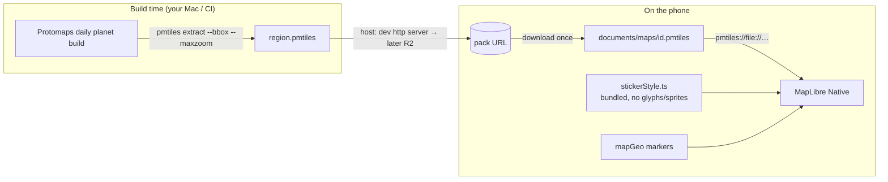

# Offline map (MapLibre + PMTiles)

`#architecture` `#map` `#offline`

The Map tab is a flat 2D map that works with **no network** after a one-time download. MapLibre Native draws a local PMTiles vector-tile file with Critterboard's own "sticker" style. It replaced the old `react-cartoon-planet` 3D globe, which has been removed.

> See also: [[../decisions/003-offline-map-maplibre-pmtiles]] (why), [[../architecture]], [[backend-adapter]] (packs will be hosted on Cloudflare R2), `tools/map/README.md` (making packs).

## How it fits together

## Pieces

| File | Role |
|---|---|
| `src/map/stickerStyle.ts` | Builds the MapLibre style from `pb.ts` colours: land with a hard ink offset shadow, ink coastlines, flat greens, chunky ink-cased roads. Pixel landmark icons (tree, flower, peak) at z13+ come from `assets/map/` via `<Images>` (regenerate with `tools/map/gen_pixel_icons.py`). No text labels, so no glyph or sprite downloads. With no pack it returns just the sea background. |
| `src/map/mapPack.ts` | Download-once helper on top of `src/lib/download.ts` (`.part` file, HTTP status, pinned size/MD5 from the pack JSON, then rename; see [[../decisions/007-download-integrity]]). A file only counts as installed if it is a *whole* archive: the header's section offsets say where it must end (`pmtilesEnd`), and a shorter file is deleted, at download and again at boot. |
| `src/components/OfflineMap.tsx` | The map component, with a `flyTo` handle. Renders markers as React views (round stickers with a `PixelBug` sprite). Registers the water wave texture with `<Images>`. |
| `src/screens/mapGeo.ts` | `altitudeToZoom()` converts the globe's camera altitudes to Mercator zoom, so the existing framing logic carries over. |
| `src/screens/Map.tsx` | `USE_OFFLINE_MAP` flag picks `OfflineMap` or the globe (native only; web still uses the globe). |
| `tools/map/extract.sh` | Cuts a region out of the Protomaps planet build; `--sizes` estimates pack size per zoom. |

## Tile schema

Protomaps basemap v4 layers: `earth`, `water`, `landcover`, `landuse`, `roads`, `buildings`, `boundaries` (plus `places` / `pois`, unused because there are no labels). Features are classified by `kind` (`park`, `forest`, `highway`, `major_road`, `minor_road`, `path`, `river`, …). Reference: <https://docs.protomaps.com/basemaps/layers>.

## Coverage and zoom

The app ships one pack for the whole supported area: **Europe, zoom ≤ 7** (`tools/map/extract.sh europe -25,34,45,72 7`, ~56 MB). That is country and region level: coastlines, lakes, rivers, borders, land cover and motorways. Street detail would be 187 MB at zoom 8 and 546 MB at zoom 9, which is too large to ship; a smaller "my city in detail" pack is a possible later add-on.

- The pack's header (`parsePmtilesHeader`, bytes 100..117) gives its bounds and deepest zoom. The map limits zoom to that depth plus 3 levels of over-zoom, so it never magnifies into mush.
- Outside the pack the background is a muted "no data" paper with a pixel-dot pattern (`assets/map/nodata.png`); the sea is drawn from a GeoJSON box of the pack's bounds (`coverage_sea` / `coverage_waves`) with real water polygons on top.
- `+` / `−` buttons call `OfflineMapHandle.zoomBy` (whole levels).
- The pack id is `europe`; a legacy spike pack (`dev`) is deleted on sight.
- Landmark icons (trees, peaks) only show at zoom 13+, so they need a street-detail pack and won't appear with the Europe pack.

**Icons need a `glyphs` entry.** MapLibre Native draws no symbol layers (our pixel POI icons) unless the style has a `glyphs` URL, even though we draw no text. The style sets `GLYPHS_PLACEHOLDER` (a local `file:` URL that is never requested), so it stays offline. Found by experiment: with the entry the trees and peaks appear, without it nothing does.

MapLibre Native briefly requests its built-in demo style at startup and cancels it as soon as our style is applied; that is inside the native library and can't be turned off from JS.

## Location and pins

The map centres on the device location whenever the OS permission is granted (the Map asks once if it never was). The user's own catches become pins when they have coordinates. Public sharing (`profile.locationShareOn`) is separate: it only decides whether coordinates are published to the backend. There are no demo sightings; an empty map shows a hint card.

## Sizing

Each extra zoom level is about 4× more data. Plan: the whole region at low zoom (≈10) inside the region pack, plus the user's local area at street zoom (14–15) as a separate "save my area" download. Measure real numbers with `tools/map/extract.sh --sizes <bbox>`.

## Status: spike

- Done: style (validated against the MapLibre style spec in tests), download-once helper, component, Map screen wiring, extract tooling. iOS/Android/web bundles and `expo prebuild` pass.
- To prove on device: MapLibre Native reads `pmtiles://file://…` from the app's documents folder on iOS, the look on a real extract, marker tap behaviour, performance, and pack sizes.
- Next: `mapUrl` in region packs, R2 hosting, remove the globe dependencies, web renderer (`maplibre-gl` + `pmtiles` protocol), OSM credit in `CreditsDialog`.

## Running on the iOS 27 simulator

- Xcode 27 / iOS 27 kill apps that don't use the UIScene life cycle. Expo SDK 57's template doesn't yet, so `plugins/withSceneDelegate.js` wires in Expo's `ExpoAppSceneDelegate` at prebuild. Delete the plugin once the Expo template does this itself.
- `pod install` needs a UTF-8 locale: `LANG=en_US.UTF-8 npx expo run:ios`.
- The device ID comes from `expo-crypto` (Hermes has no global `crypto`).
- To see the map, make a pack with `tools/map/extract.sh` and serve it ([[../../tools/map/README]]). Landmark icons only appear at zoom 13 and up.

## Licensing

Map data is © OpenStreetMap contributors (ODbL). The style sets the source attribution, and MapLibre's attribution button shows it on the map.
