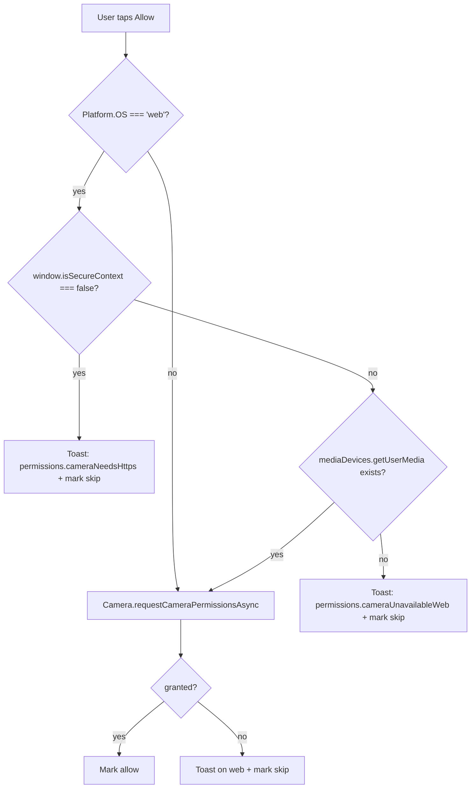

#permissions #web #frontend

# Permissions on the web

## Why this exists

On native (iOS / Android), the camera is a hard requirement for the core "snap a bug" flow. On the web — especially **mobile Safari** — it isn't reliably reachable, and treating it as required leaves users stuck on the Permissions screen with no explanation.

Mobile Safari refuses `navigator.mediaDevices.getUserMedia` unless:

1. The page is served over **HTTPS** (or `localhost`). On HTTP, `navigator.mediaDevices` is `undefined` entirely.
2. The browser exposes `mediaDevices.getUserMedia` at all (older / restricted contexts may not).

When either condition fails, `expo-camera`'s web shim catches the error and returns `DENIED` silently. The previous flow then marked camera as `'skip'` while keeping the Continue button disabled — a soft brick.

## Decision

Treat camera as **recommended (not required)** on web, surface the real failure reason as a toast, and let the user proceed to use the gallery picker.

| Platform | `needKey` | `required` | Skip allowed | Gate |
|---|---|---|---|---|
| iOS / Android | `required` | `true` | no | must be `'allow'` |
| Web | `recommended` | `false` | yes (`'Not now'`) | any decision (`'allow'` or `'skip'`) |

## Pre-flight on web

Before delegating to `Camera.requestCameraPermissionsAsync()`, the `Permissions` screen runs `diagnoseWebCameraAvailability()`:

This gives mobile-Safari users an actionable explanation instead of a dead button:

- **HTTP context** → "iOS Safari needs HTTPS for the camera. Use the photo picker instead."
- **Missing API** → "Camera unavailable here — use the photo picker instead."

## Why the photo picker is enough

`Scan.tsx` already falls back gracefully when camera permission isn't granted:

- The viewfinder shows the stylised `CameraScene` placeholder.
- The gallery icon button (`🖼️`) launches `expo-image-picker`, which on the web is implemented as a hidden `<input type="file">` — no runtime permission needed.
- The classifier accepts a `null` URI and still routes the user through `result` / `disambiguate` / `nomatch`, so the rest of the app works without camera at all.

So the worst-case web experience is "snap" → "pick a photo", which is acceptable and discoverable.

## Native behaviour is unchanged

`Platform.OS === 'web'` gates the relaxed logic entirely. On iOS and Android, camera is still required, the "Not now" pill is still disabled for camera, and the Continue button stays gated on `cameraAllowed`. The wire-level call to `Camera.requestCameraPermissionsAsync()` is identical.

## Related

- [[modules/responsive-layout-shell]] — the broader "make this work as a web app" thread.
- `src/screens/Permissions.tsx` — the implementation.
- `src/screens/Scan.tsx` — the downstream consumer that handles missing camera.
