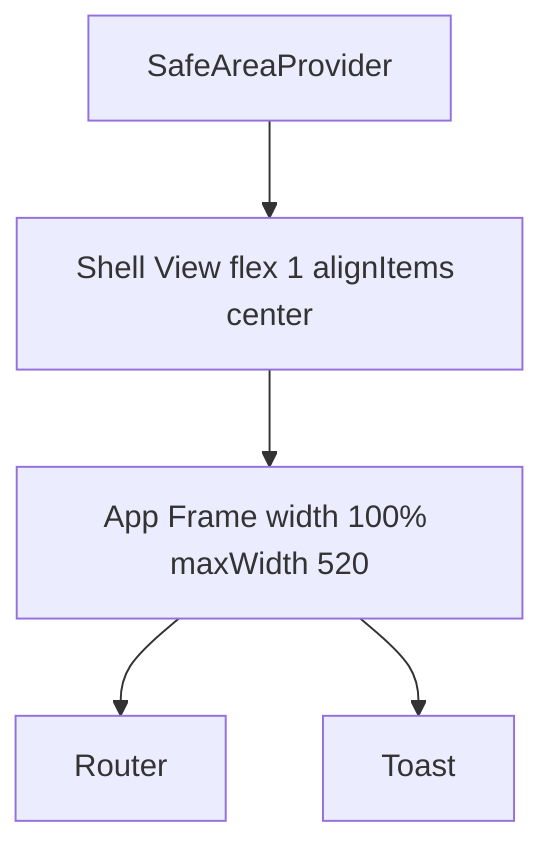

#layout #frontend #architecture

# Responsive layout shell

## Why this exists

The app UI is intentionally mobile-first, with many screens using full-width cards and absolute-positioned bottom navigation. On larger screens (desktop web, tablets), this made content stretch too wide and look visually broken.

## Decision

Use a single global shell in `App.tsx`:

- Outer shell fills the viewport and centers content horizontally.
- Inner app frame keeps `width: 100%` with `maxWidth: 520`.
- Existing screens remain unchanged and continue rendering inside the constrained frame.

This keeps one layout system for all routes without per-screen responsive branches.

## Data flow / render structure

## Impact

- Large screens now keep readable line lengths and balanced spacing.
- Absolute-positioned UI (for example the tab bar) aligns to the app frame, not the full desktop viewport.
- Small screens remain unchanged because widths under `520` still render at full width.
- Me/Quests/Leaderboard tab labels now use `minWidth: 0` + `numberOfLines={1}` + shrink-friendly styles, preventing text overflow in tighter header rows.

## Related

- [[docs/architecture]]
- [[tasks/todo]]
