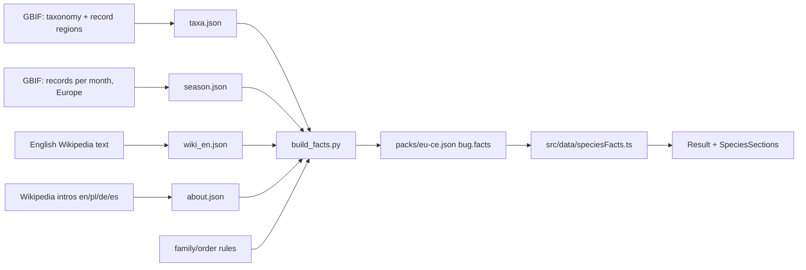

#species #data #education

# Species facts

The species card (Result screen) is built from `Bug.facts`, made offline by `tools/facts/` and shipped inside the region pack JSON. Bundled species get the same facts once the pack is installed (pack entries replace them by id); without a pack the card shows only the photo, names and actions.

Top to bottom:

- **Hero**: your photo (from the scan, or your catch's photo), name, Latin name, order in plain words · family.
- **Badges**: garden friend / can be a pest, pollinator, eats aphids, hunter, recycler; a **safety** line (harmless, can bite, can sting, tick, irritating hairs).
- **About**: two sentences from Wikipedia in the UI language (credited CC BY-SA), else just the "read more" link.
- **Facts grid**: habitat, size (or family), range, diet, with "typical for its family" underneath.
- **Your catch**: date caught, "Show on map" when it has coordinates (opens the Map on that point).
- **How big?**: the size next to an everyday object (sesame seed … phone), two bars to scale.
- **When to look**: records per month in Europe as 12 bars, the busiest stretch in words, and "spotted N× near you" when shared sightings are on.
- **Life cycle**: stages from the order (complete / incomplete metamorphosis, spiders, ticks and mites).
- **Actions**: Share (photo + text on iOS, text on Android) once caught; Remove from Dex is a small link.



## Where each value comes from

| Tile | Source | How reliable |
|---|---|---|
| Range | GBIF occurrence counts per region (kept when ≥1% and ≥20 records) | Good, but reflects where people *record* species |
| Size / wingspan | First length or wingspan sentence in the English Wikipedia article (~75% of species) | Good; mm/cm range, otherwise the tile shows the family |
| Habitat | Rules by order/family in `build_facts.py` | **Typical for the family**, not species research |
| Diet | Same rules | **Typical for the family**; texts say "mostly" where families differ |
| Family | GBIF taxonomy | Good |
| Season (`m`) | GBIF records per month in Europe, 0–9 relative to the busiest month | Good; shows when people *record* it, which follows when it's active |
| About (`ab`) | First two sentences of the Wikipedia intro per language; kept only when the intro names the binomial | Good; missing where that language has no article |

Computed in the app (`src/data/speciesFacts.ts`, unit-tested), so a fix needs no pack rebuild:

| Rule | From | Note |
|---|---|---|
| Order in plain words | `o` | `facts.order.*` |
| Badges | traits + diet key | pollinator, eats aphids, hunter, recycler |
| Garden friend / pest | curated genus and species lists, then badges | Pest wins; the list includes the coming household species |
| Safety | family and genus | Ticks, stinging families, biting families, irritating caterpillars and blister beetles; everything else "harmless" |
| Life cycle | order | Unknown orders show nothing |
| Size comparison | `sz` midpoint | Closest everyday object by ratio |

Texts are translated (`facts.habitatOf.*`, `facts.dietOf.*`, `facts.region.*`) in all four languages. The card also links to the species' Wikipedia page in the UI language.

## Updating

```bash
python3 tools/facts/fetch_taxonomy.py   # GBIF, ~5 min (throttled)
python3 tools/facts/fetch_wiki.py       # Wikipedia, ~3 min
python3 tools/facts/fetch_season.py     # GBIF records per month, ~5 min
python3 tools/facts/fetch_about.py      # Wikipedia intros in 4 languages, ~5 min
python3 tools/facts/build_facts.py      # writes packs/eu-ce.json, bumps its version
```

Then bump `packs/manifest.json` to the new pack version. Related: [[i18n]], [[backend-adapter]].
