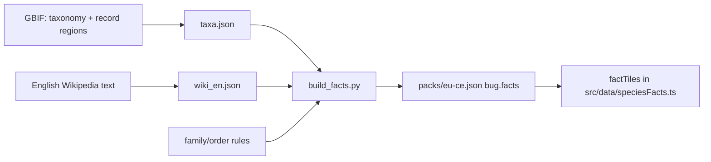

#species #data #education

# Species facts

The species card (Result screen) shows four tiles: habitat, size (or family), range and diet. For the 20 bundled species these are hand-written (`FACT_KEYS` in `src/screens/Result.tsx`). For region-pack species they come from `Bug.facts`, built offline by `tools/facts/` and shipped inside the pack JSON.



## Where each value comes from

| Tile | Source | How reliable |
|---|---|---|
| Range | GBIF occurrence counts per region (kept when ≥1% and ≥20 records) | Good, but reflects where people *record* species |
| Size / wingspan | First length or wingspan sentence in the English Wikipedia article (~75% of species) | Good; mm/cm range, otherwise the tile shows the family |
| Habitat | Rules by order/family in `build_facts.py` | **Typical for the family**, not species research |
| Diet | Same rules | **Typical for the family**; texts say "mostly" where families differ |
| Family | GBIF taxonomy | Good |

Texts are translated (`facts.habitatOf.*`, `facts.dietOf.*`, `facts.region.*`) in all four languages. The card also links to the species' Wikipedia page in the UI language.

## Updating

```bash
python3 tools/facts/fetch_taxonomy.py   # GBIF, ~5 min (throttled)
python3 tools/facts/fetch_wiki.py       # Wikipedia, ~3 min
python3 tools/facts/build_facts.py      # writes packs/eu-ce.json, bumps its version
```

Then bump `packs/manifest.json` to the new pack version. Related: [[i18n]], [[backend-adapter]].
