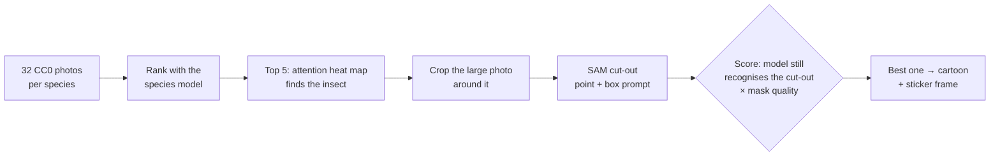
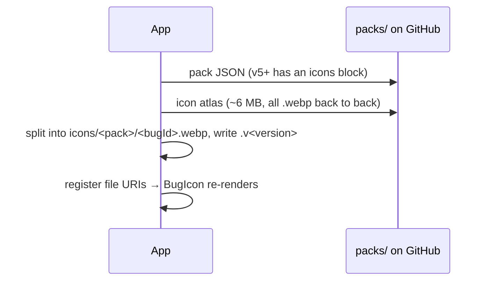

# Species icons

`#module` `#ml` `#assets`

Every pack species gets a sticker-style icon drawn from a **real photo** of that species, so the cartoon looks like the actual insect. Species without an icon keep their emoji.

> Related: [[ml-roadmap]], [[architecture]], [[handoff]]. Code: `src/data/bugIcons.ts`, `src/components/BugIcon.tsx`, `training/vision/make_icons.py`, `training/vision/build_icon_atlas.py`.

## Look

A cut-out of the insect with flattened cartoon colours (about 7 per icon) and ink lines, framed like the app's stickers: a cream border, an ink outline and a hard offset shadow. Icons are 256 px WebP, about 9 KB each; the `eu-ce` atlas (icons v1, pack v5) is 9.1 MB for 1,000 species.

In the Dex, uncaught species show the icon as an **ink silhouette** (the same image, tinted), so the shape is a hint without giving away the colours.

## How an icon is made (offline, `make_icons.py`)

- **Photos:** iNaturalist open data, **CC0** where a species has at least 8 CC0 candidates, otherwise CC-BY too (credited in `packs/icons/CREDITS.md`).
- **Finding the insect:** a gradient-weighted attention map from the trained ViT, for the target species. A salient-object cutter (the first attempt) kept the flower or leaf the insect sat on in about a quarter of icons; prompting SAM at the attention peak segments just the insect.
- **Choosing the photo:** the species model must still recognise the cut-out on a grey background, and the mask must be big enough in pixels, one solid shape and sharp. Photos where the insect is tiny, blurred or only partly segmented lose.
- **Review:** contact sheets, then `--reject taxon_id=photo_id` to redo a bad pick with the next best photo (or `--override taxon_id=photo_id` to force one). The model's scores don't separate good from bad icons, so review is by eye.

### Icons v1 in numbers

- All 1,000 icons come from **CC0** photos (no species needed the CC-BY fallback); `packs/icons/CREDITS.md` still names each photo and photographer.
- Review: 148 of 1,000 rejected in the first pass (15%), 20 of those again in the second; for 5 species an earlier pick was kept as the least bad.
- Typical rejects: a caterpillar instead of the adult, a shapeless blob (fuzzy bumblebees and mining bees are the weakest group), or a flower/leaf kept in the cut-out.
- Kept on purpose: galls and leaf mines (that's what people see of gall wasps, gall mites and leaf miners), and caterpillars for species usually met as larvae (e.g. pine processionary, lackey, goat moth).

### Icons v2 (pack v13, Oct 2026)

- 108 new icons for the species the household model added, drawn with that model; the 1,000 v1 icons are unchanged (cut from the v1 atlas, so `make_icons.py` skipped them). All 1,108 from **CC0** photos.
- Review: 16 of 108 rejected in the first pass (shapeless blobs, a crane fly's wings, a moth on its flower), 3 of those again. Kept on purpose: aphid colonies on a stem, a gooseberry sawfly larva on its leaf, ermine-moth webs, a bagworm case and a paper-wasp nest.
- `build_icon_atlas.py` needs `selection.csv` rows for every icon: the v1 rows were rebuilt from `packs/icons/CREDITS.md` (logins → ids via the iNaturalist `observers.csv`).

## Delivery with the pack

- The pack JSON's `icons` block holds the atlas URL, an icon version and each bug's `[offset, length]`. One file keeps the download to a single request. The atlas is checked against the size/MD5 pinned in the same block ([[../decisions/007-download-integrity]]), and only ids that look like species ids (`a-z`, `0-9`, `-`) are written, since they become file names.
- **Install** (Settings) fetches icons after the model. **Boot** registers icons already on disk, or fetches them if missing. **Pack update** re-fetches icons only if their version changed and skips the model if its URL didn't change (v5 adds icons, not a new model).
- **Uninstall** deletes the folder. Web has no pack install, so it shows emoji.
- Everything is best-effort: any failure leaves the emoji fallback.

## Where icons show

Dex grid, Home recent catches, Result hero (when there is no photo), Disambiguate candidates, Map species card, Activity catch rows, region detail samples and friend profiles: all through `<BugIcon bug size silhouette? />`.
