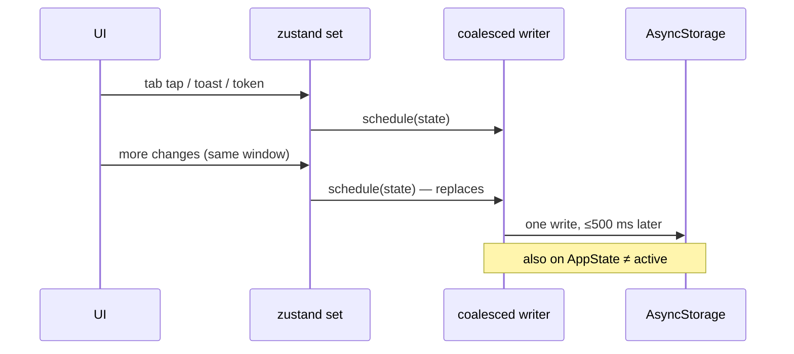

# UI performance

`#architecture` `#performance` `#store`

How the app keeps the JS thread free: what is batched, what stays mounted, what is cached. From the UI performance review of 2026-10-02.

> Related: [[../architecture]], [[offline-map]], [[species-icons]], [[backup-restore]].

## Saving the store

zustand's `persist` calls the storage after **every** `set`: each tab tap (the nav stack lives in the store), each toast, each chat token. The saved blob holds every chat thread and the 1,200-entry memory index, about 0.5 MB for an active user.

- `createCoalescedWriter` (`src/store/useAppStore.ts`): the first change opens a 500 ms window, later changes only replace the value, and the window's end writes the latest state. Writes run one at a time, in order.
- `App.tsx` flushes it when the app leaves the foreground, so a kill from the app switcher keeps the last change.
- **Nothing is written before the saved state has loaded.** zustand's hydrate replaces state without saving, so a write queued before it (e.g. the launch-time language seed) would have saved first-run defaults over the user's data.
- The window can lose at most the last ~0.5 s of changes if the app crashes in the foreground.

## Navigation and screens

- **Hydration gate.** The store's `hydrated` flag (not saved) turns true once the saved state was read, or failed to read. The Router renders nothing until then, so returning users don't see onboarding flash by.
- **Kept tabs.** Home, Dex and Me stay mounted (hidden with `opacity: 0`, no touches, hidden from screen readers) after their first visit. Coming back is instant and keeps scroll and search. `display: none` was avoided: the layout collapses and a list loses its offset.
- Kept screens are keyed by route name + params: new params remount (screens seed state from params, e.g. the Leaderboard tab).
- **Route params via context.** `useCurrentRoute()` reads the entry its screen was rendered for (`RouteContext`), not the top of the stack, so a hidden tab doesn't see another screen's params.
- **Scan and Map still mount per visit.** A camera and a GL surface are not reliably hidden by a parent's opacity on Android, and their slow parts are cached instead (below).
- `Router` is memoised and `Toast` reads its own state, so a toast or a catch no longer re-renders the whole screen from the app root.

## Caches

| What | Where | Lifetime |
|---|---|---|
| Vision model (`.pte`, ~88 MB) | `acquireModel` / `releaseModel` in `src/ai/executorchVision.ts` | Kept while Scan is used, freed 60 s after the last Scan leaves (so it doesn't sit in RAM next to the chat model). Reloaded when the model file or label map changes. |
| Latin name → species | `findBugByLatin` in `src/data/bugs.ts` | Rebuilt on each `mergeBugs`. A scan maps ~1,000 labels: this was a linear search per label. |
| PMTiles header | `cachedPmtilesInfo` in `src/map/mapPack.ts` | Filled by the installed-map check that runs on every Map visit, so the map style is built once. |
| Region pack JSON | `documents/packs/<id>.json` (`src/data/regionPacks.ts`) | A file, not one AsyncStorage value (Android can't read those back past ~2 MB). Old AsyncStorage copies move over on first read. |

## Rendering

- **Chat:** the thread is saved when a reply ends (and the user's message when it's sent), not per streamed token; bubbles are memoised, so only the streaming one re-renders.
- **Map pins:** one GeoJSON source with a symbol layer (`assets/map/pin-catch.png`, from `tools/map/gen_pixel_icons.py`) and a circle layer for "you", instead of a React view with an SVG per pin.
- **Streak math:** `streakSummary` does one freeze replay for current/best/freezes. Day-based memos include today's date, so a kept screen rolls over at midnight on its next render.
- **i18n:** `bugName` uses `lookupFor` (no missing-key warning) because most pack species have no i18n key; the warning made Dex slow in dev builds.

## Not done

- `expo-image` for Dex icons: only if profiling on a device shows image decode jank.
